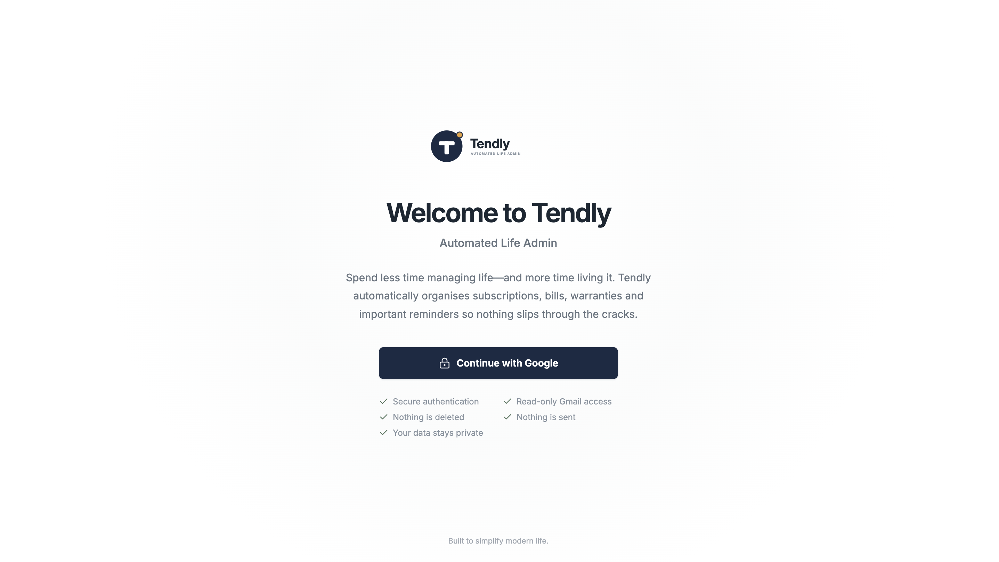
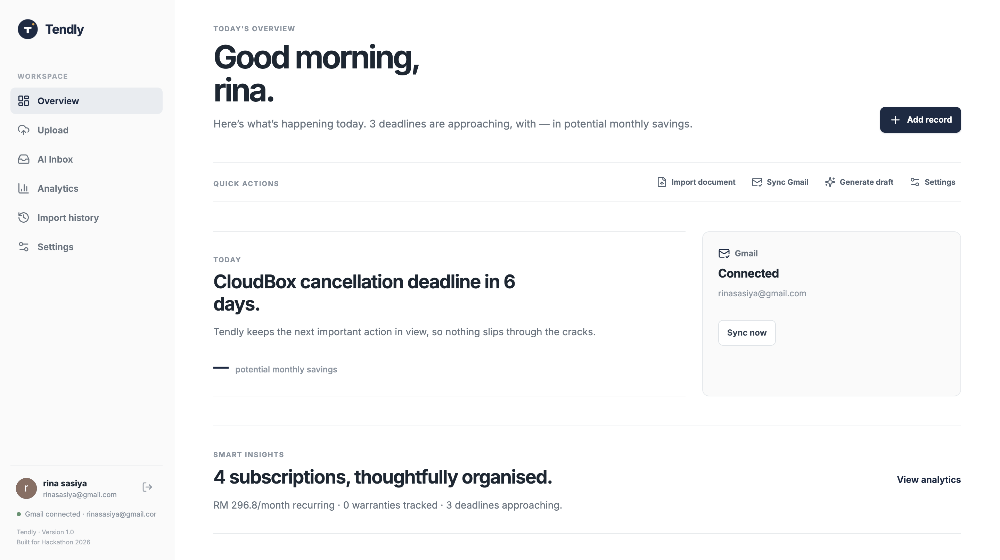
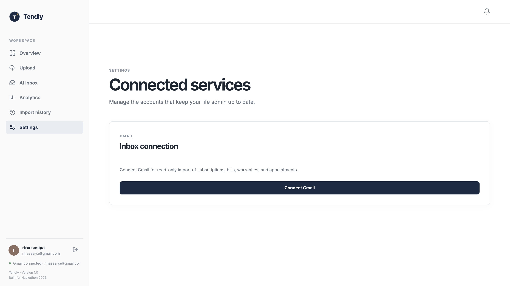
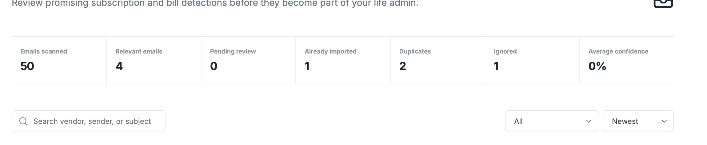
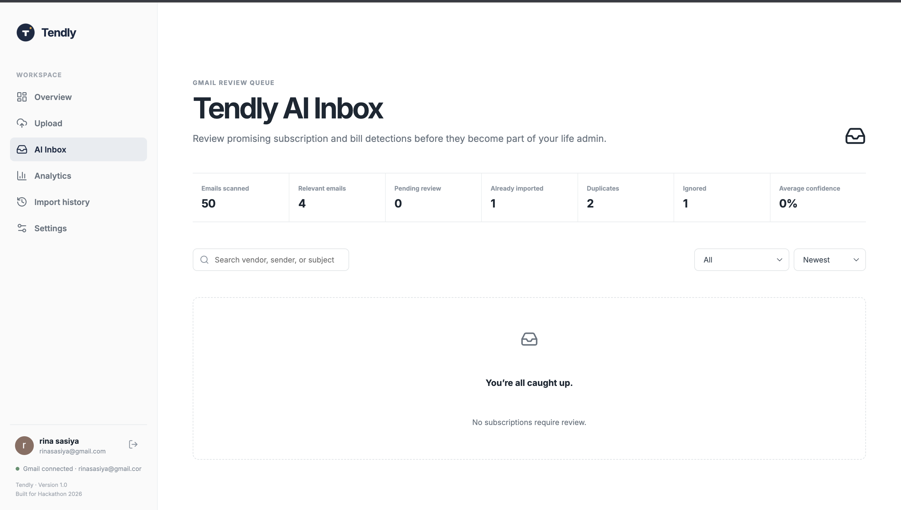
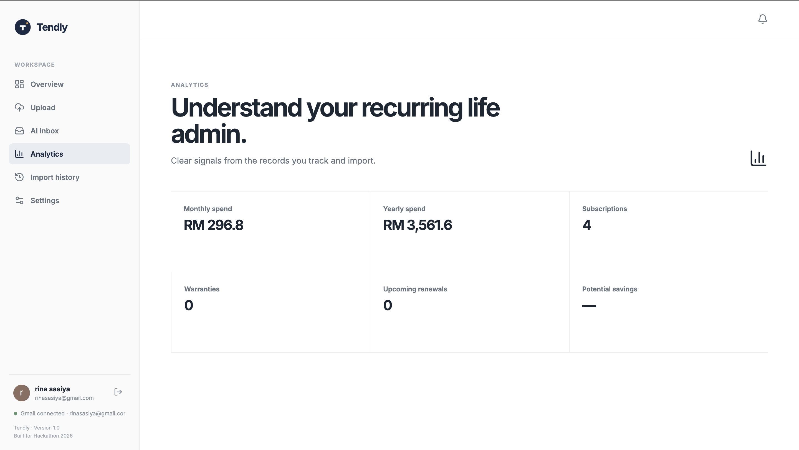
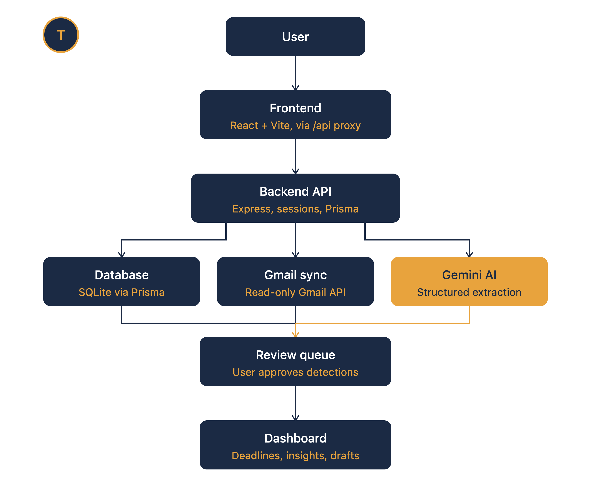

# Tendley

An AI-powered personal administration assistant that transforms emails and documents into organized records, deadlines, and actionable insights.



---

# Project Overview

Managing personal administration has become increasingly difficult due to the large amount of information people receive through emails and digital documents.

Important details such as:

- Subscription renewals
- Bills and invoices
- Warranty information
- Payment deadlines
- Service agreements
- Important documents

are often buried inside thousands of emails, causing users to miss deadlines, forget recurring payments, or lose track of important information.

## Solution

Life Admin Autopilot is an AI-powered productivity assistant that connects with a user's Gmail account and automatically identifies important administrative information.

The system uses Gmail API integration, Google OAuth 2.0 authentication, and Gemini AI to extract meaningful information from emails and convert them into structured records.

Instead of manually searching through emails, users can:

- Automatically scan relevant emails
- Extract important information using AI
- Review AI-generated records before saving
- Track deadlines and subscriptions
- Monitor spending insights
- Generate actionable reminders

The goal is to reduce digital clutter and help users manage their personal administration efficiently.

---

# Screenshots

## Dashboard Overview



The dashboard provides users with an overview of imported records, upcoming deadlines, spending insights, and Gmail synchronization status.

---

## Gmail Connection



Users can securely connect their Gmail account through Google OAuth 2.0 authentication with read-only email access.

---

## Gmail Sync Summary



After synchronization, users receive a summary showing:

- Total emails scanned
- Imported records
- Skipped emails
- Duplicate records
- Failed processing attempts

---

## AI Extraction Review



Gemini AI extracts structured information including:

- Vendor name
- Amount
- Transaction type
- Dates
- Categories
- Confidence score

Users can review, edit, import, or ignore extracted records before they are stored.

---

## Analytics Dashboard



Provides insights into:

- Recurring expenses
- Subscription tracking
- Upcoming deadlines
- Spending patterns
- Potential savings opportunities

---

# System Architecture



The system follows a full-stack architecture combining frontend technologies, backend services, external APIs, AI processing, and database management.

## Architecture Flow

User

↓

React Frontend

↓

Express.js Backend

↓

- Google OAuth 2.0
- Gmail API
- Gemini AI

↓

Prisma ORM

↓

Database

---

# Features

## Gmail Integration

- Google OAuth 2.0 authentication
- Secure read-only Gmail access
- Gmail API integration
- Automatic email synchronization
- MIME multipart email parsing
- HTML-to-text email conversion
- Attachment exclusion for privacy and efficiency

---

## AI-Powered Information Extraction

Life Admin Autopilot uses Gemini AI to analyze emails and extract structured information.

AI capabilities include:

- Vendor detection
- Amount extraction
- Currency identification
- Date extraction
- Transaction classification
- Subscription detection
- Confidence scoring
- Structured JSON generation

AI-generated information is validated before being stored in the database to reduce inaccurate records.

---

## Smart Email Filtering

The system automatically filters irrelevant emails to improve extraction accuracy.

Filtered categories include:

- OTP messages
- Password reset emails
- Promotional emails
- Newsletters
- Delivery notifications
- Spam-like content
- Non-administrative emails

Only relevant emails are processed by the AI extraction pipeline.

---

## AI Review System

Instead of directly saving AI-generated results, extracted information enters a review workflow.

Users can:

- Review extracted information
- Edit incorrect fields
- Approve records
- Import records into the system
- Ignore irrelevant results

This provides users with control over AI-generated data before permanent storage.

---

# Gmail Synchronization Workflow

## 1. User Authentication

Users authenticate through Google OAuth 2.0.

The system requests:

- Gmail read-only permission
- Secure access token authentication

---

## 2. Email Retrieval

The backend communicates with Gmail API to retrieve emails.

The system:

- Fetches relevant emails
- Processes MIME email structures
- Converts HTML emails into readable text
- Removes unnecessary attachments

---

## 3. Email Filtering

Retrieved emails are analyzed using keyword-based filtering.

The system identifies:

- Financial emails
- Subscription emails
- Warranty information
- Administrative messages

Irrelevant emails are skipped.

---

## 4. AI Extraction

Relevant emails are sent to Gemini AI.

The AI extracts:

- Vendor
- Amount
- Dates
- Categories
- Transaction details

---

## 5. Validation & Review

Extracted results are validated and placed into the review queue.

Users can:

- Approve
- Modify
- Reject

before importing the final record.

---

# Technology Stack

## Frontend

- React 18
- TypeScript
- Vite
- Tailwind CSS

## Backend

- Node.js
- Express.js
- TypeScript

## Database

- Prisma ORM
- SQLite / PostgreSQL

## AI & External APIs

- Google Gemini API
- Gmail API
- Google OAuth 2.0

## Development Tools

- Git & GitHub
- Postman
- Visual Studio Code
- npm

---

# AI Implementation

Gemini AI is integrated into the application for intelligent information processing.

AI is used for:

- Email content understanding
- Important information extraction
- Vendor classification
- Transaction categorization
- Structured JSON generation
- Generating cancellation or refund email drafts

The AI pipeline includes validation steps before database insertion to ensure extracted records maintain reliability and accuracy.

---
## AI Development Process: Codex & GPT-5.6

During the development of Tendly, I used OpenAI Codex and GPT-5.6 as AI development assistants to improve productivity, code quality, and problem-solving.

### How Codex was used

Codex helped accelerate my development process by assisting with:

- Generating and improving frontend components
- Debugging implementation issues
- Refactoring code for better structure and maintainability
- Explaining unfamiliar code and suggesting improvements
- Assisting with API integrations and backend development

I used Codex as a coding partner to iterate faster while maintaining control over the final implementation and design decisions.

### How GPT-5.6 was used

GPT-5.6 supported my development process by helping with:

- Brainstorming product ideas and user workflows
- Designing system architecture and feature planning
- Improving user experience decisions
- Reviewing technical approaches
- Generating documentation and project descriptions
- Refining the presentation and demo flow

GPT-5.6 helped me transform an initial idea into a structured AI-powered application by providing guidance and feedback throughout the development process.

### AI-Assisted Development Approach

I combined my own development decisions with AI assistance. These tools helped me move faster, explore different solutions, and overcome technical challenges, while I remained responsible for implementation, testing, and the final direction of Tendly.

# Installation

## 1. Clone Repository

```bash
git clone https://github.com/sasiyarina-create/life-admin-autopilot.git
cd life-admin-autopilot
```

## Backend Setup

Navigate to backend:

```bash
cd backend
```

Install dependencies:

```bash
npm install
```

Create environment variables:

```env
DATABASE_URL=

GOOGLE_CLIENT_ID=
GOOGLE_CLIENT_SECRET=
GOOGLE_REDIRECT_URI=

GEMINI_API_KEY=

SESSION_SECRET=
```

Run database migration:

```bash
npx prisma migrate dev
```

Start backend server:

```bash
npm run dev
```

## Frontend Setup

Navigate to frontend:

```bash
cd frontend
```

Install dependencies:

```bash
npm install
```

Start development server:

```bash
npm run dev
```

# Project Structure

```text
life-admin-autopilot/
│
├── frontend/
│   ├── src/
│   ├── components/
│   ├── pages/
│   └── services/
│
├── backend/
│   ├── controllers/
│   ├── routes/
│   ├── services/
│   ├── prisma/
│   └── middleware/
│
├── screenshots/
│
├── README.md
└── package.json
```

# Security Considerations

The system implements several security practices:

- Google OAuth 2.0 authentication
- Read-only Gmail permission access
- Environment variable protection
- API key security
- Secure session handling
- Input validation
- AI output validation before database storage
- Protected API routes

User Gmail content is only processed after explicit authorization.

# Future Improvements

## AI Improvements

- More advanced email classification
- Personalized AI recommendations
- Improved extraction accuracy
- Automated priority detection

## Productivity Features

- Calendar integration
- Automatic reminders
- Mobile application support
- Smart notification system

## Financial Management

- Budget tracking
- Spending predictions
- Subscription cancellation assistance
- Financial reports

## Document Intelligence

- PDF invoice scanning
- Receipt OCR
- Document categorization
- Cloud storage integration

# Author

Developed by: Sasiya Rina

GitHub: [https://github.com/sasiyarina-create](https://github.com/sasiyarina-create)

# License

This project is developed for educational and portfolio purposes.
